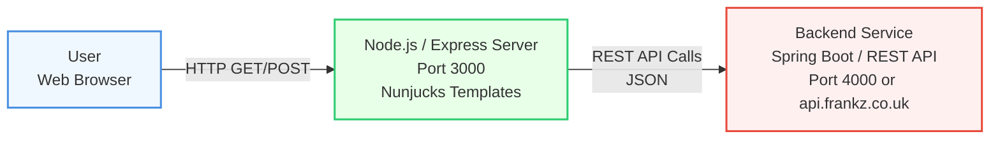

# HMCTS Dev Test Frontend

This is the Front-End to create, update, delete, and list Tasks with the use of a REST API backend.
That backend was developed earlier and can run locally as a Spring Boot application, or in the cloud
as an AWS API Gateway with the same REST API.

# Prerequisites

- IDE: Visual Studio Code on Windows
- _yarn_ is installed. If not, run `npm install -g yarn`
- _ts-node_ is installed. If not, run `npm install -g ts-node`
- _.sh_ and _bash_ can be executed. If not, like on a Windows machine, file _nodemon.json_ is adjusted here,
  as [below](#Troubleshoot_execute_sh)
- relative paths can be found. If not, _app.ts_ is adjusted like as [below](#Troubleshoot_find_src)
- git bash with openssl on Windows also need a fix, to avoid _/C_ translated to \_C:\_

# Package modifications (follown advice from CoPilot)

This code is forked of from [hmcts-dev-test-frontend](https://github.com/hmcts/hmcts-dev-test-frontend),
which has [basic steps below](#Follow_Basic_steps_from_Upstream) that are assumed
to work, but do not on my Windows environment with a git bash.
Some of the details I added as Troubleshoots below.
I used Copilot to help me to change the installed packages, to get it working for me.
It has been a difficult journey.

The steps below are the first ones that I took, and are stored in this forked git repository.

- Advice from CoPilot is that PnP should be avoided and use _node-modules_ in stead:
  1.  `yarn config set nodeLinker node-modules`,
  1.  add `"types": ["node"]` to _tsconf.json_,
  1.  `yarn add -D @types/node`,
  1.  `yarn remove @types/serve-favicon`,
  1.  `npm install -D @types/node`,
  1.  `yarn install`
- `npm install dotenv` <br>
  A file .env is added, which is picked up with by _dotenv_.
  The .env file will contain user/environment specifics, like the url for the Back-end.
- `npm audit fix --omit=dev` <br>
  which resolves vulnerabilities if possible, and excludes _codecept_ issues which are for testing only,
  so can be ignored.

# Follow Basic steps from Upstream

1. `yarn install`
2. `yarn webpack`
3. Run the Back-End demo-case application on port 4000. That should be provided from cloning the backend.
4. `yarn start:dev`

# Design

Architecture diagram



Schematic flow diagram

```
┌───────────────────┐
│ APP START         │
└───────┬───────────┘
        │
        ▼
┌───────┴──────────────────────────────────────────────────┐
│ home.ts, route '/', view home.njk                        │
│ 3 buttons                                                │
│ ┌──────────────┐ ┌─────────────────┐ ┌─────────────────┐ |
│ │ DEMO SUB-APP │ │ TASK SUB-APP    │ │ TASK SUB-APP    │ |
│ |              | | setBackendUrl   | | setBackendUrl   | |
│ |              | | localhost:4000  | | api.frankz.co.uk| |
│ │ /demo route  │ │ /task/list      │ │ /task/list      │ |
│ └───────┬──────┘ └──────────┬──────┘ └──────────┬──────┘ |
|         |                   └──────────┬────────┘        |
└─────────┴──────────────────────────────┴─────────────────┘
          │                              │
          ▼                              ▼
┌─────────────────┐     ┌─────────────────────────────────────────────────────┐
│ demo.ts         │     │ list.ts, /tastk/list, list.njk                      │
│ view demo.njk   |     | getBackendUrl                                       |
│ localhost:4000  |     | /task/get-all-tasks                                 |
└─────────────────┘     │                                                     │
                        │ Create Task button (/task/create)                   |
      ┌─────────────────|                                                     │
      │                 │ For each task:                                      |
      |     ┌───────────| - Update Status dropdown and button                 |
      |     |           |     /task/update/{id}/status/{s}                    │
      │     │    ┌──────│ - Manage button                                     |
      |     |    |      |     /task/get/{id}                                  |
      |     |    |    ┌─| - Delete button                                     |
      |     |    |    | |     /task/delete/{id}                               │
      |     |    |    | └─────────────────────────────────────────────────────┘
      ▼     ▼    ▼    ▼                                        ▲
┌──────────────────────────────┐                               |
| create.ts                    |                               |
| getBackendUrl                |                               |
| /task/create                 |                               |
│ redirect → /task/list        │ ──────────────────────────────┘
└──────────────────────────────┘                               ▲
┌──────────────────────────────┐                               |
| updateStatus.ts              |                               |
| getBackendUrl                |                               |
| /task/update/:id/status/:s   |                               |
│ redirect → /task/list        │ ──────────────────────────────┘
└──────────────────────────────┘                               ▲
┌──────────────────────────────┐                               |
| delete.ts                    |                               |
| getBackendUrl                |                               |
| /task/delete/:id             |                               |
│ redirect → /task/list        │ ──────────────────────────────┘
└──────────────────────────────┘                               ▲
┌──────────────────────────────┐                               |
| view.ts, view.njk            |                               |
| getBackendUrl                |                               |
| /task/view/:id               |                               |
│ Update button                |                               |
| /task/update                 │                               |
└──────────────────────────────┘                               |
           |                                                   |
           ▼                                                   |
┌──────────────────────────────┐                               |
| update.ts                    |                               |
| getBackendUrl                |                               |
| /task/update                 |                               |
│ redirect → /task/list        │ ──────────────────────────────┘
└──────────────────────────────┘
```

# Technology Stack

- Visual Studio Code
- Node.js 22
- TypeScript 5.9.3
- Express
- Nunjuck
- Jest

# Troubleshoot

Working on a Windows machine with a maiden VSC did not allow `yarn start:dev` to run without changes.

## Troubleshoot execute sh

Error with _generate-ssl-options.sh_ might be caused by running Node.js in Windows.
It needs help with executing a bash shell. We had to change _nodemon.json_
to add _bash_ in the _exec_ command so that windows starts bash and executes the shell script.

```js
 "exec": "bash ./bin/generate-ssl-options.sh && ts-node ./src/main/server.ts"
```

## Troubleshoot find src

Errors like _App tried access src_ might also be caused by running Node.js in Windows.
It needs help with relative paths. We had to change _app.ts_ like:

```js
glob
  .sync(__dirname + '/routes/**/*.+(ts|js)')
  //  .map(filename => require(filename))
  .map(filename => {
    const full = path.resolve(filename);
    console.log('Loading route file:', full);
    return require(full);
  })
  .forEach(route => route.default(app));
```

## Troubleshoot openssl

_/C=GB/ST=A/L=B/O=C/OU=D/CN=E_ gets rewitten to
_C:/Users/.../PortableGit/C=GB/ST=A/L=B/O=C/OU=D/CN=E_
by Git Bash on Windows.
It needs an additional slash.

## Troubleshoot Lint

Lint should be configured to be platform independent, so need to adjust the carriage returns for windows:

```js
'linebreak-style': 'off',
```

Add because we have added alias paths in our code, Lint needs to support that as well.

`yarn add -D eslint-import-resolver-alias`

Running locally Lint cannot handle the large amount of files.
In _package.json_ we needed to add extra double quotes around _\**/*.scss_.

```js
"lint": "stylelint \"**/*.scss\" -v -q && eslint . --ext .js,.ts && prettier --check .",
```
